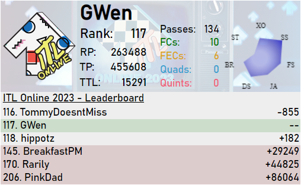

# itlwidget
Streamer widget and API for [ITL Online 2022](https://itl2023.groovestats.com).

To download the repository you can click on `Code` and then `Download ZIP`:

To run the widget download the repository and follow the instructions in `widget/readme.md`.

Acknowledgements:

Dark theme of the widget was provided courtesy of [Freis](https://github.com/gab-santi), minor modifications have been made.